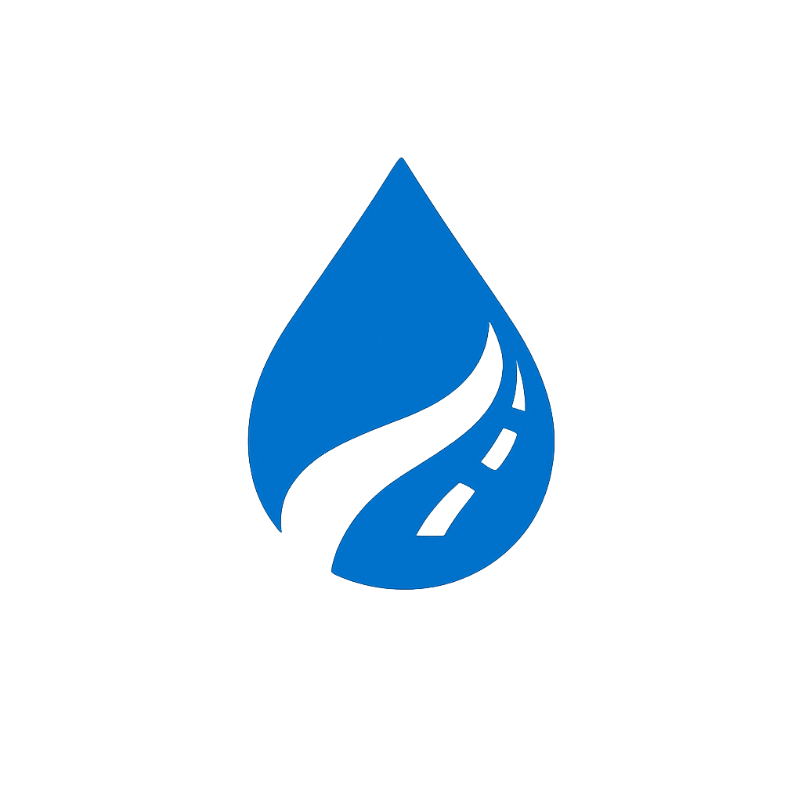

<p align="center">
  
</p>

<h3 align="center">Fleet Fuel & Trip Log for Small Fleets</h3>

<p align="center">
  Track trips, fuel refuels, and weekly fleet costs in one place.<br/>
  Built for Sri Lankan fleets with 3–30 vehicles.
</p>

<p align="center">
  <a href="https://fueltrack-lk.vercel.app">🌐 Live Demo</a> &nbsp;·&nbsp;
  <a href="https://fueltrack-lk.vercel.app/book-a-demo">📅 Book a Demo</a> &nbsp;·&nbsp;
  <a href="https://fueltrack-lk.vercel.app/free-template">📄 Free Template</a>
</p>

---

## ✨ Features

- **Trip Logging** — Record every trip with driver, vehicle, and mileage details
- **Fuel Entry Tracking** — Log fuel refuels with receipt proof uploads
- **Weekly Fleet Reports** — Auto-generated summaries of fleet costs and usage
- **Multi-Vehicle Support** — Manage fleets of 3–30 vehicles effortlessly
- **Responsive Design** — Optimized for desktop, tablet, and mobile
- **Smooth Animations** — Scroll reveals, hover effects, and micro-interactions powered by Lenis

---

## 📄 Pages

| Page          | Route            | Description                                          |
| ------------- | ---------------- | ---------------------------------------------------- |
| Home          | `/`              | Hero section, animated stats, and feature highlights |
| Features      | `/features`      | Detailed breakdown of all product features           |
| Pricing       | `/pricing`       | Plans and pricing information                        |
| How It Works  | `/how-it-works`  | Step-by-step product walkthrough                     |
| Resources     | `/resources`     | Guides, articles, and helpful resources              |
| Book a Demo   | `/book-a-demo`   | Schedule a live product demo                         |
| Free Template | `/free-template` | Download a free fuel log template                    |

---

## 🛠️ Tech Stack

| Technology                                   | Purpose                         |
| -------------------------------------------- | ------------------------------- |
| [Next.js 16](https://nextjs.org)             | React framework with App Router |
| [React 19](https://react.dev)                | UI library                      |
| [Tailwind CSS 4](https://tailwindcss.com)    | Utility-first styling           |
| [Lenis](https://lenis.studiofreight.com)     | Smooth scrolling                |
| [TypeScript](https://www.typescriptlang.org) | Type safety                     |
| [Vercel](https://vercel.com)                 | Deployment & hosting            |

---

## 🔍 SEO & Analytics

- JSON‑LD structured data (Organization, WebSite, SoftwareApplication)
- Open Graph & Twitter Card meta tags
- Dynamic sitemap & robots.txt
- Google Analytics 4 (GA4) integration
- Google Tag Manager

---

## 🚀 Getting Started

### Prerequisites

- Node.js ≥ 18
- npm, yarn, pnpm, or bun

### Installation

```bash
# Clone the repository
git clone https://github.com/devmaniac1/fueltrack-lk.git
cd fueltrack-lk

# Install dependencies
npm install

# Start the development server
npm run dev
```

Open [http://localhost:3000](http://localhost:3000) to view the app.

### Build for Production

```bash
npm run build
npm start
```

---

## 📁 Project Structure

```
fueltrack-lk/
├── public/
│   ├── Logo.png
│   ├── images/          # Page images & assets
│   └── assets/          # Additional assets
├── src/
│   ├── app/
│   │   ├── page.tsx             # Home page
│   │   ├── layout.tsx           # Root layout + SEO
│   │   ├── globals.css          # Global styles
│   │   ├── features/            # Features page
│   │   ├── pricing/             # Pricing page
│   │   ├── how-it-works/        # How It Works page
│   │   ├── resources/           # Resources page
│   │   ├── book-a-demo/         # Book a Demo page
│   │   ├── free-template/       # Free Template page
│   │   ├── sitemap.ts           # Dynamic sitemap
│   │   └── robots.ts            # Robots.txt config
│   ├── components/              # Reusable UI components
│   └── lib/                     # Utilities & config
└── package.json
```

---

## 🌐 Deployment

This project is deployed on **Vercel** at **[fueltrack-lk.vercel.app](https://fueltrack-lk.vercel.app)**.

To deploy your own instance:

1. Push your code to GitHub
2. Import the repository on [Vercel](https://vercel.com/new)
3. Vercel auto-detects Next.js and deploys

---

## 📝 License

This project is private and proprietary.

---

<p align="center">
  Made with ❤️ for Sri Lankan fleet managers
</p>
